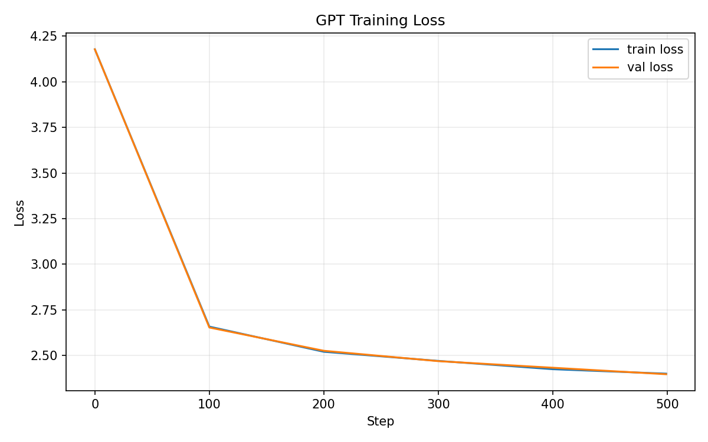

# gpt-from-scratch

A minimal GPT implementation in PyTorch, trained on Shakespeare

[](https://www.python.org/)
[](https://pytorch.org/)
[](LICENSE)
[](https://colab.research.google.com/)

## What I built

This project is a from-scratch implementation of a small Transformer-based language model inspired by GPT. It is trained on the 1.1MB Shakespeare corpus using character-level tokenization, so every input token is a single character. The goal is to understand the GPT architecture by manually implementing each core component instead of treating the model as a black box.

## Architecture

```txt
Input tokens
    |
    v
Token Embedding + Positional Embedding
    |
    v
N x Transformer Block
    |
    +--> LayerNorm -> Multi-Head Attention -> Residual Add
    |
    +--> LayerNorm -> FeedForward -> Residual Add
    |
    v
LayerNorm
    |
    v
Linear Head
    |
    v
Logits
```

| Parameter | Value |
|---|---:|
| n_layer | 6 |
| n_head | 6 |
| n_embd | 384 |
| block_size | 256 |
| batch_size | 64 |
| max_iters | 5000 |
| learning_rate | 3e-4 |
| dropout | 0.2 |

## Results

Quick training validation, using 500 iterations and a smaller CPU-friendly model, reached a validation loss of **2.3975**. A full Colab run with the complete configuration is expected to reach approximately **1.5-1.7** validation loss.



Generated sample from the quick 500-iteration run:

```txt
ININORCIRRPDS:
I ouro y the anisie fof my isthacas t Wa hefis ar acha ar
Be oke ld:
Thof f ve thisilit de din ond pe pr;
Milthn heaiche t ourd mon yo d owis ion fatel blem tha t omy ch
```

The incoherent text is expected for a very short CPU smoke test. With the full Colab training run, the model should produce text with more recognizable Shakespeare-like structure, including line breaks, names, and play-style dialogue patterns.

## Key Components

**Causal Self-Attention:** Queries, keys, and values are projected manually with linear layers. A lower-triangular causal mask prevents each token from attending to future positions.

**Positional Embedding:** The model uses learned positional embeddings instead of sinusoidal encodings. This lets the model learn how token order matters directly from the training data.

**Weight Tying:** The token embedding matrix and the language-model head share the same weights. This reduces the number of parameters and follows a common GPT-style modeling pattern.

**Pre-norm:** LayerNorm is applied before each attention and feed-forward sub-layer. This GPT-2 style layout usually makes Transformer training more stable.

## Project Structure

```txt
gpt-from-scratch/
├── assets/           # training plots and generated samples
├── checkpoints/      # saved model weights (git-ignored)
├── data/
│   └── tiny_shakespeare.txt
├── model/
│   ├── attention.py  # Head, MultiHeadAttention, FeedForward, Block
│   ├── gpt.py        # GPTLanguageModel, build_model
│   └── __init__.py
├── notebooks/        # exploratory and visualization notebooks
├── utils/
│   └── tokenizer.py  # CharacterTokenizer, ShakespeareDataset
├── config.py         # all hyperparameters in one place
├── train.py          # training loop with AdamW and checkpointing
└── generate.py       # text generation with CLI arguments
```

## How to Run

### Local

```bash
git clone https://github.com/artur-source/gpt-from-scratch
cd gpt-from-scratch
pip install -r requirements.txt
python train.py
python generate.py --prompt "To be or not to be" --max_tokens 300 --temperature 0.8 --top_k 40
```

### Google Colab

Open the project using the Colab badge at the top of this README. In Colab, use a T4 GPU by selecting **Runtime -> Change runtime type -> T4 GPU**. A full training run with the complete configuration should take about **15-20 minutes**.

## References

- [Attention Is All You Need](https://arxiv.org/abs/1706.03762) - Vaswani et al., 2017
- [Language Models are Unsupervised Multitask Learners](https://cdn.openai.com/better-language-models/language_models_are_unsupervised_multitask_learners.pdf) - Radford et al., 2019
- [nanoGPT](https://github.com/karpathy/nanoGPT) - Andrej Karpathy

Built by Artur as a portfolio project - Systems Analysis and Development, UniPiaget
